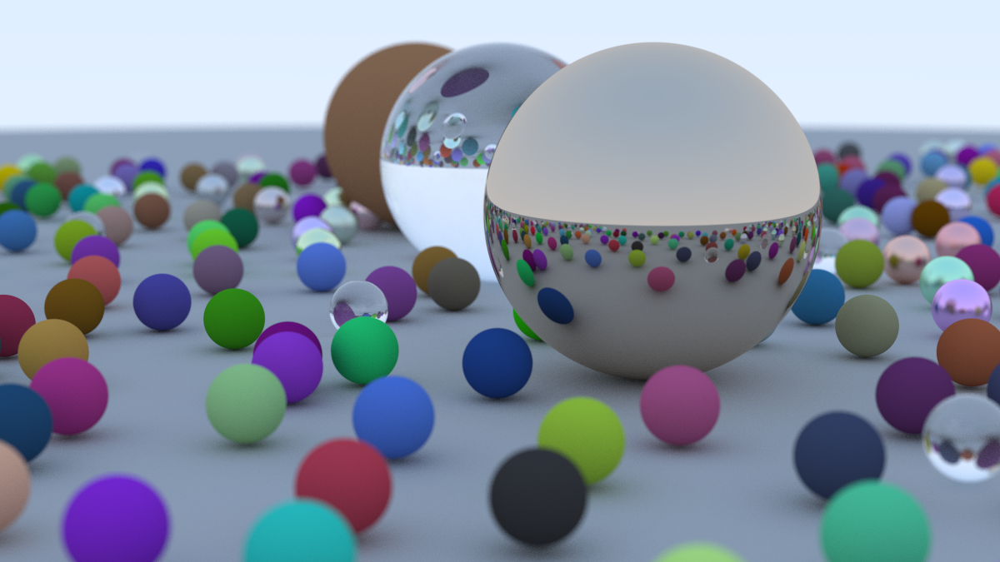

# First Raytracer

```{post} July 05, 2024
:tags: projects
:category: graphics
```

A month ago, I set out on a journey to learn Rust. At the same time,
I wanted to try my hand at something related to computer graphics,
so I decided to build my very own path tracer. I'm quite happy with
how it turned out, as you can see with my final render.



But what is a Ray tracer?

The fundamental idea behind ray tracing (or more specifically, path tracing)
is to render images that accurately depict how something looks like in real life.
This means shadows, colors, all that stuff.

Any video game you play, or movie that involves semi-realistic CGI, is almost guarenteed
to have some ray tracing - otherwise it would just look even more fake!

But how does it work?

Effectively what happens is we pretend to take a ray of light, and shoot it at some pixels.
It then computes the color seen in the direction of the rays. Along the way, we have to calculate
which objects the ray intersects.

Let's say the ray starts at the origin, which we'll call $\mathbf A$, and
it points in a direction $\mathbf d$. Then, we can represent the ray as the
function $\mathbf P(t)=\mathbf A+t\mathbf d$.

Now we have to figure out how to insersect it with an object - for mathematical simplicity,
we'll choose a sphere. A sphere has the equation (in cartesian coordinates):

$$x^2+y^2+z^2=r^2$$

If we want there sphere to be at a point $(C_x, C_y, C_z)$, we then have
the equation of that sphere as:

$$(x-C_x)^2+(y-C_y)^2+(z-C_z)^2$$

Doing all these subtractions and exponents is quite costly, so let's try to express
it in terms of vectors and matricies. Interestingly enough, the vector from the center
$\mathbf C=(C_x, C_y, C_z)$ to a point $\mathbf P=(x, y, z)$ is simply $(\mathbf P-\mathbf C)$.

By the definition of the dot product, we have that

$$(\mathbf P-\mathbf C)^2=(x-C_x)^2+(y-C_y)^2+(z-C_z)^2$$

Thus, any point $\mathbf P(t)$ that satisfies this equation will be on the sphere.

You can then plug in $\mathbf P(t)=\mathbf A+t\mathbf d$, and solve the quadratic
to get our conditions for a ray intersecting a sphere.

But if you naively try to implement this, you'll notice that the edges of every
shape are jagged. To fix this, we have to sample some rays *around* the pixel,
and average out the color. This way each pixel isn't the same color until suddently
the object ends. You can see the difference in these two images, where the left is before
and the right is after:


The more rays we sample per pixel, the closer it will be to looking "smooth". This is
called *Antialiasing*!

A lot of stuff still needs to happen to get a working raytracer - namely, setting up normals,
figuring out ray bounces, occlusion, and much more. But that's a topic for a whole other blog post!

As for where I learned this?
Check out [https://raytracing.github.io/](https://raytracing.github.io/). The guide
is written in C++, but you can find my Rust code [on Github](https://github.com/JasonGrace2282/raytracing/tree/rust-1)
