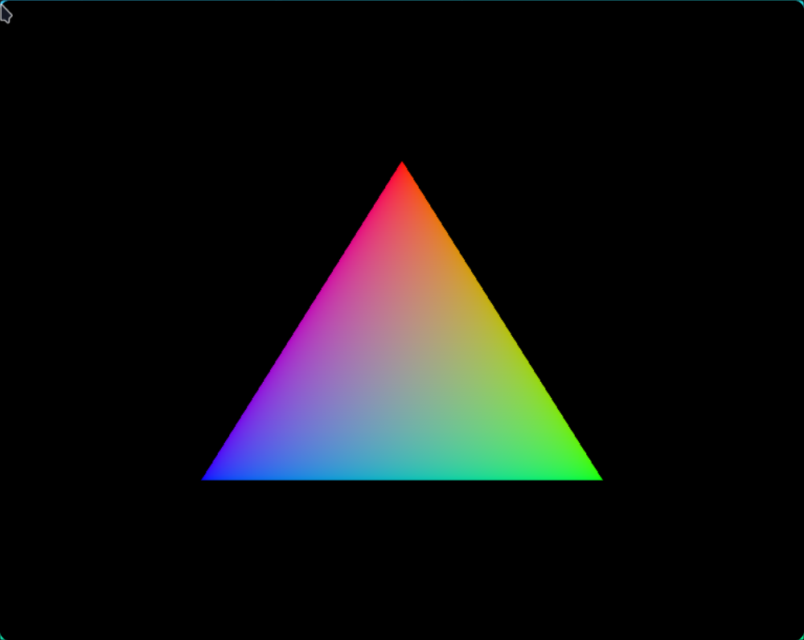

# A Vulkan Triangle

```{post} July 09, 2024
:category: graphics
```

I spent the last few days working on making a Triangle in Vulkan.
After I was done, it looked something like this



Now, I know what you're thinking. Why is making an (admittedly pretty nicely
colored) triangle so impressive?
Well the answer is, it's really not, but there's a lot more that had to go on
to make this triangle.

After a lot of the initial set up (making sure the GPU has the features we
need, creating the window, etc), we can start talking about how your GPU works
behind the scenes (at a very high level).

First we have the concept of a swapchain. You can think of this sort of like a
list of render targets, and we would render stuff to something at a certain index.
In this way, every time we want to render a frame we can

1. Ask the swap chain for an image to render to
2. Draw the frame onto the image
3. Put it back in the swapchain so it can be displayed later

But then how do we draw the frame? Well first we have to wrap the image from the 
swap chain in a `VkImageView`, which allows access to certain parts of the image.
We also need to create a `VkFramebuffer`, which will reference `VkImageView`s that
will be used for things like color and depth.

Next we can do a render pass. Inside each render pass are subpasses, where we would
do stuff like post-processing. Then we can start our *graphics pipeline*.

The graphics pipeline is a sequence of pieces of code (called shaders) that run on the GPU.
Everything we have done so far is effectively setting up for this part. In this post, we're
only going to focus on two types of shaders, out of the many that can be used. These
are the vertex shader, and the fragment shader.

Before we do that, we have to choose something called a primitive. In our case, we'll choose
a triangle - how primitives work will be explained in a second.

The vertex shader tells the GPU where each point should be. The GPU will then connect these points
using our primitive. This means that if we give the GPU three points and choose the triangle
primitive (called `VK_PRIMITIVE_TOPOLOGY_TRIANGLE_LIST` in Vulkan) it will connect the three
points into a triangle.

So how do we put the points into the GPU? To keep it simple, we'll hardcode it. We'll define
the points in the vertex shader, and look up our current point at runtime. We'll also have to
do the same for colors, since the shader that figures out the color doesn't have access to the
current vertex index.

```glsl
#version 450

// define all of our points on our triangle
// Vulkan uses a system where x axes goes left to right
// from -1 to 1, and top to bottom from -1 to 1
vec2 positions[3] = vec2[](
    vec2(0.0, -0.5),
    vec2(0.5, 0.5),
    vec2(-0.5, 0.5)
);

// define our colors: red blue and green
// these match up to our vertices
vec3 colors[3] = vec3[](
    vec3(1.0, 0.0, 0.0),
    vec3(0.0, 1.0, 0.0),
    vec3(0.0, 0.0, 1.0)
);

// We're exporting our color at location=0 as a 3D vector
layout(location = 0) out vec3 fragColor;

void main() {
    // set the current vertex position to the position at the current
    // vertex index we're on. The z value is 0, and to prevent perspective
    // division (google it!) we set w=1
    // note that gl_Position and gl_VertexIndex are builtins
    gl_Position = vec4(positions[gl_VertexIndex], 0.0, 1.0);

    // set the color of the pixel. This will be sent to the next shader that
    // needs it.
    fragColor = colors[gl_VertexIndex];
}
```

Now we can work on our shader that actually chooses the color. It's called the fragment
shader, and it runs after all the vertices and triangles have been drawn and everything
has been pixelized by the rasterizer. Our vertex shader did most of the work of finding
out the color, so all we need to do is tell our GPU what color the vertex shader decided on:

```glsl
#version 450

// take in the vertex shaders color at location=0
layout(location = 0) in vec3 fragColor;

// and export it to the GPU
layout(location = 0) out vec4 outColor;

void main() {
    // set the opacity as 1 and send it to the GPU
    outColor = vec4(fragColor, 1.0);
}
```

Phew! That was a lot! Now we need to show our results on the window. We first ask
the swap chain for an image, choose the right command for it and execute it, and return it to the
swap chain via `vkQueuePresentKHR`. But wait! We have to be careful! GPUs are by nature
asyncronous, meaning that each call to a function will return before it's finished.
But we want to *first* find the right command, *and then* execute it, *and then* submit
it to the queue, which is inheritently syncronous.

Vulkan has a nice solution called semaphores for this. They are effectively signals-
they're turned off, and once an operation is finished they're turned back on. For 
example, the function to execute a command will wait until `semaphoreA` is turned on,
which will happen when choosing the right command finally finishes finding a valid command.

These semaphores work on the GPU, so that the CPU can keep going without having to
wait for a GPU. In some cases, such as when finishing rendering a frame, the CPU
will want to wait for the GPU: in this case, one can use something called a Fence.

Just as a teaser, I'll post the code which does the whole semaphore stuff.
```cpp
void mainLoop() {
  while (!glfwWindowShouldClose(window)) {
    glfwPollEvents();
    drawFrame();
  }

  // wait until all frames have finished
  vkDeviceWaitIdle(device);
}

void drawFrame() {
  // wait for previous frame to finish
  vkWaitForFences(device, 1, &inFlightFence, VK_TRUE, UINT64_MAX);
  // reset fence to unsignaled state
  vkResetFences(device, 1, &inFlightFence);

  // get the image from the swap chain
  uint32_t imageIndex;
  vkAcquireNextImageKHR(device, swapChain, UINT64_MAX, imageAvailableSemaphore, VK_NULL_HANDLE, &imageIndex);
  vkResetCommandBuffer(commandBuffer, 0);
  recordCommandBuffer(commandBuffer, imageIndex);

  // submit the command into the queue
  VkSubmitInfo submitInfo{};
  submitInfo.sType = VK_STRUCTURE_TYPE_SUBMIT_INFO;

  // semaphore!
  VkSemaphore waitSemaphores[] = {imageAvailableSemaphore};
  VkPipelineStageFlags waitStages[] = {VK_PIPELINE_STAGE_COLOR_ATTACHMENT_OUTPUT_BIT};
  submitInfo.waitSemaphoreCount = 1;
  submitInfo.pWaitSemaphores = waitSemaphores;
  submitInfo.pWaitDstStageMask = waitStages;
  // which command buffers to execute
  submitInfo.commandBufferCount = 1;
  submitInfo.pCommandBuffers = &commandBuffer;

  // which semaphores to signal on finish
  VkSemaphore signalSemaphores[] = {renderFinishedSemaphore};
  submitInfo.signalSemaphoreCount = 1;
  submitInfo.pSignalSemaphores = signalSemaphores;

  // submit to the graphicsQueue
  if (vkQueueSubmit(graphicsQueue, 1, &submitInfo, inFlightFence) != VK_SUCCESS) {
    throw std::runtime_error("failed to submit draw command buffer!");
  }

  // present it to the window
  VkPresentInfoKHR presentInfo{};
  presentInfo.sType = VK_STRUCTURE_TYPE_PRESENT_INFO_KHR;

  presentInfo.waitSemaphoreCount = 1;
  presentInfo.pWaitSemaphores = signalSemaphores;

  VkSwapchainKHR swapChains[] = {swapChain};
  presentInfo.swapchainCount = 1;
  presentInfo.pSwapchains = swapChains;
  presentInfo.pImageIndices = &imageIndex;

  // put it back on the swapchain to be displayed
  vkQueuePresentKHR(presentQueue, &presentInfo);
}
```

Almost 1000 lines of code to render a triangle, that's a lot!
Next? I'll probably see if I can finish the rest of the Vulkan tutorial :)

If you're interested in learning more, check out the [Vulkan tutorial](https://vulkan-tutorial.com/),
and if you're interested in seeing my (admittedly pretty bad) C++
code, you can find it [here](https://github.com/JasonGrace2282/vulkan).

Until next time!
