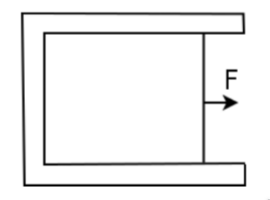

# Pressure and Surface Tension

:::{post} January 29, 2025
:tags: physics
:::

When it comes to fluids, there's a few things that were never explained
on my first introduction to the subject. In this post, I intend to explain
*why* pressure is the same in all directions, and what surface tension actually is.

## Pressure is Isotrophic
Consider an infinitisimal wedge in the $xz$ plane, where the cross section is along
the $y$ direction.

{w=400px align=center}

Writing $F=ma$ in the $z$ direction gives

$$p_z\,\mathrm{d}x\,\mathrm{d}y-p_n\cos\theta\left(\dfrac{\mathrm dx}{\cos\theta}\right)\mathrm dy - \rho g\,\mathrm dV=\rho\,\mathrm dV \ddot{z}$$

Taking the limit as $\mathrm dx\to 0,\mathrm dy\to 0,\mathrm dx\to 0$, we end up with

$$p_z=p_n$$

Applying a similar process to the $x$ direction gives us

$$p_x=p_z=p_n\mathrel{\vcenter{:}}= p$$

Since we made no assumptions about the angle $\theta$, we can vary it to whatever we're concerned about.
It follows that the pressure in the $y$ direction is also the same, by rotating the wedge an angle $\phi$ relative
to the $z$ axis. Therefore the pressure is isotrophic (i.e. the same in all directions), and we can make pressure
a scalar without worrying about its direction.

## Surface Tension
Water molecules are held together by strong, *attractive*, hydrogen bonds. By $F=-\nabla U$, this
means that the potential energy is negative. This potential energy is called the *binding energy*,
and can also be viewed as the work taken to bring a molecule from infinity into the liquid without
changing the kinetic energy (note that this is negative because it must opposite the attractive forces).

It turns out that the curve of the binding energy decreases fast enough that the contributions to it
depend largely on its immediate neighbors. Using this information, we can create a simplified model
of surface energy. Take for example the figure below.

{align=center}

Let the particle inside the liquid have an energy $E$ (where $E<0$ because the binding energy is negative).
In comparison, the particle at the surface has half the neighbors so it will have a binding energy of approximately
$E/2$. The other $E/2$ of energy is stored as positive potential energy in the surface, called surface energy.
Based on this model, the surface energy should be proportional to the surface area, because a larger surface
area will have more molecules.

In light of this, we can introduce a new quantity, the surface tension $\gamma$:

$$\gamma=\dfrac{\mathrm dU}{\mathrm dA}$$

Thus surface tension is just a measure of the potential per unit area.
However, if there's a potential there must also be a force. To find the force,
consider the following apparatus, where we have a liquid film surrounded by a U-shaped frame.
One of it's ends are pierced by a wire of length $\ell$ and is pulled by a force $F$.
If we assume the wire moves at a constant velocity, then that implies that it balances
the force of surface tension.

{align=center}

We can find $F$ (and thus the force of surface tension) by applying the principle of virtual work. The work done by $F$ after
moving a distance $\delta x$ is $F\delta x$. By $W=-\Delta U$, the work done by the liquid
film would be $W=-2\gamma\mathrm dA=-2\gamma l\delta x$. In this case the two comes from the
fact that there are two films: the one shown in the picture, and the one on the opposite side of
the figure. By the principle of virtual work, we then have that

$$F\delta x-2\gamma l\delta x=0\implies F=2\gamma \ell$$

Surface tension is a really cool thing - for example, it means that the pressure inside a spherical
droplet is larger inside then outside. I'll probably write another blog post to touch on some of
the applications, as well as stuff like the Young-Laplace equation.
