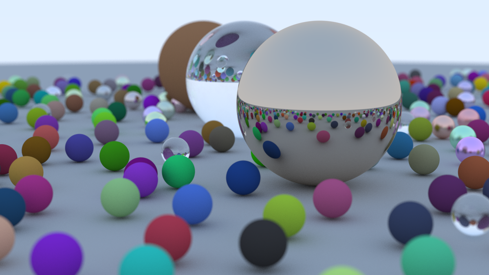

A month ago, I set out on a journey to learn Rust. At the same time,
I wanted to try my hand at something related to computer graphics,
so I decided to build my very own path tracer. I'm quite happy with
how it turns out, as you can see with my final render.

But what is a Ray tracer or a path tracer?
